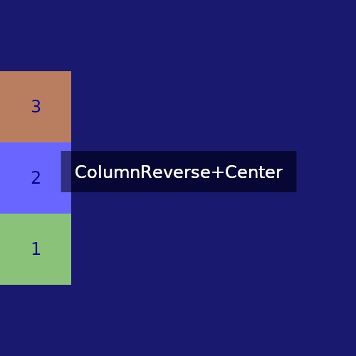

# nim-yoga
nim bindings for Facebook's Yoga layout library

## Example
```nim
import [
  yoga_enums,
  yoga
]

const
  rootW = 500
  rootH = 500
  childW = 100
  childH = 100
  
proc main() =
  let root = newYGNode()
  root.styleSetWidth(rootW)
  root.styleSetHeight(rootH)
  
  let node1 = newYGNode()
  node1.styleSetWidth(childW)
  node1.styleSetHeight(childH)

  let node2 = newYGNode()
  node2.styleSetWidth(childW)
  node2.styleSetHeight(childH)

  let node3 = newYGNode()
  node3.styleSetWidth(childW)
  node3.styleSetHeight(childH)

  root.insertChild(node1, 0)
  root.insertChild(node2, 1)
  root.insertChild(node3, 2)

  root.calculateLayout(rootW, rootH, YGDirectionLTR)
  
  #root=(top=0.0 left=0.0 width=500.0 height=500.0)
  #node1=(top=0.0 left=0.0 width=100.0 height=100.0)
  #node2(top=0.0 left=100.0 width=100.0 height=100.0)
  #node3(top=0.0 left=200.0 width=100.0 height=100.0)
```
# Showcase
(drawn with [nimskia!](https://github.com/mvenditto/nimskia))
<br>

